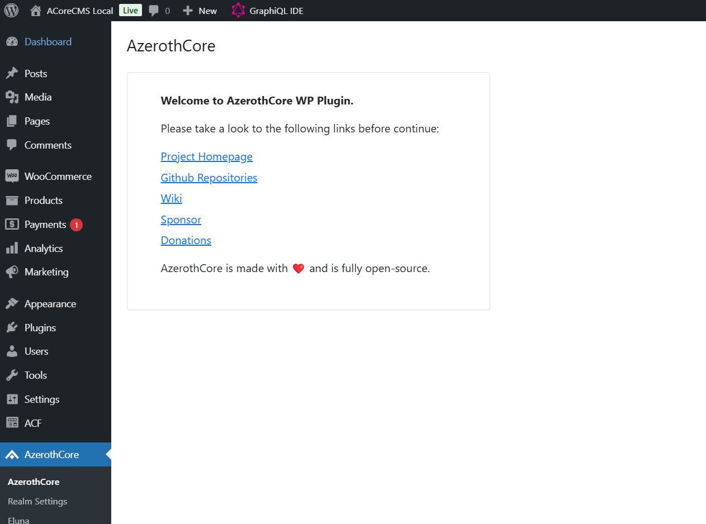

# ACore CMS

ACore CMS is a content management system based on WordPress, designed to provide a robust and flexible platform for managing your website content. 
**ACore CMS has been built to be integrated with AzerothCore**, allowing features such as account registration, WooCommerce integration (to sell items and services), etc.
It leverages the power of Docker for easy setup and deployment, and includes a variety of plugins to extend its functionality. 

## Features

- **Easy Setup**: Quickly get started with Docker and docker-compose.
- **Extensible**: Includes a variety of plugins such as WooCommerce, and you can add or create more. Extend it with any WordPress plugins, themes, and consume the REST/GraphQL APIs available.
- **AzerothCore Integration**: Integrated with AzerothCore to provide account registration, item selling, and more.

Whether you're building a simple website or a complex e-commerce site, ACore CMS provides the tools you need to create and manage your content effectively.



## Requirements

- Docker & docker-compose
- Nodejs & npm

If you do not have **docker**, [install it](https://docs.docker.com/compose/install/).

About **Nodejs & npm**, you can install it from [here](https://nodejs.org/en/).


## Installation & Usage

### 1. Configure your .env file

Create an `.env` file and copy the `.env.docker` content file to `.env`, configuring the variables as you prefer.

The most important variables are:
```bash
DOCKER_WORDPRESS_URL=http://localhost # the url of the website
DOCKER_WORDPRESS_TITLE=ACoreCMS # the title of the website
DOCKER_WORDPRESS_ADMIN_USER=admin # the wordpress admin username
DOCKER_WORDPRESS_ADMIN_PASSWORD=admin # the wordpress admin password
DOCKER_WORDPRESS_ADMIN_EMAIL=admin@example.com # the wordpress admin email
```

### 2. Build and start the docker containers

```
npm run docker:install
```

This process will take some time, once everything is done you should get a message like this in your console:

```
php-1        | [31-Dec-2024 13:13:27] NOTICE: fpm is running, pid 1
php-1        | [31-Dec-2024 13:13:27] NOTICE: ready to handle connections
```

Now you can see the website in [http://localhost:80/](http://localhost:80/).

Make sure that your port 80 is not already used by another service like Apache2, nginx etc.

If you want to change the port, you can change it from `.env` through the parameter `DOCKER_HTTP_PORTS` and `DOCKER_HTTPS_PORTS`.

Example:
```
DOCKER_HTTP_PORTS=8080:80
DOCKER_HTTPS_PORTS=443:443
```

The env variables above are used to configure the ports within the docker-compose file. To understand how port configurations work in docker-compose, please take a look at the [official documentation](https://github.com/compose-spec/compose-spec/blob/master/spec.md#ports)

**Note**: if you change this after the wordpress installation remember to change also the siteurl and related wordpress parameters in `wp_options` table.

Finally, you can stop your containers with `Ctrl+C`

### 3. Run WordPress in background

You probably don't want to have your terminal busy with the docker-compose logs, so you can run the containers in background mode:

```bash
npm run docker:start:d
```


### 4. Update the containers

If you want to update the containers, you can run the following command:

```bash
npm run docker:update
```

NOTE: wordpress files and database will be preserved. To update the wordpress version, you need install it manually through the admin panel.

## Guides

- [Connect the CMS to AzerothCore server and enable the shop](configure-cms.md)
- [Connect the CMS to AcoreDocker and enable the shop](configure-acore-docker.md)
- [How to install a theme](themes.md)

Useful tutorials:
- [How to restrict the access with credentials of a specific web page](https://ubiq.co/tech-blog/how-to-password-protect-directory-in-nginx/)

### Work with local source files

By default, the source files of the wordpress installation are stored in a named volume. This is useful for production environments, but if you want to work with the source files locally, you can use a host folder instead of the named volume.
You can set the `DOCKER_WORDPRESS_SRC_PATH` variable in the `.env` file to the path of the host folder you want to use.

```bash
DOCKER_WORDPRESS_SRC_PATH=./srv
```

### Export and import source files from the named volume

#### Export source files

You can export the source files of the current wordpress installation inside the /srv folder (backup) with the following command:

```bash
npm run docker:srv:export
```

#### Import source files

You can import the source files under /srv/ folder inside the /var/www/html container folder(restore backup) with the following command:

```bash
npm run docker:srv:import
```

IMPORTANT: this command needs to be executed with a bash-compatible shell and it will stop the php running container. After the import is done, you can start the container again.


### AzerothCore integration

ACore CMS is designed to work with AzerothCore. The ac-network included in our docker-compose file is a network that connects the AzerothCore server with the CMS. This network can be flagged as external which means that you need an azerothcore server spinned up using its own docker-compose file to make it work. 
If you are using azerothcore with the docker-compose file provided by us, you can running acore-cms with docker by setting DOCKER_AC_NETWORK_EXTERNAL to true in the .env file.

Please check this guide: [Connect the CMS to AcoreDocker and enable the shop](https://github.com/azerothcore/acore-cms/blob/master/docs/configure-acore-docker.md)

### Multirealm support

ACoreCMS is designed to support multiple AzerothCore realms by creating new WordPress sites. Multi-site support is enabled by default, but it can be switched off before the installation if desired. This allows you to create multiple websites within a single WordPress installation. You can manage multiple AzerothCore realms by creating a new WordPress site for each realm.

NOTE: AzerothCore plugin supports a single connection with a single character database, which is why it's important to create multiple sites such that each site has different character connections.

#### Subdomain vs. Subpath

You can choose to create new websites either in a subdomain or a subpath. This is controlled by the `DOCKER_MULTISITE_USE_SUBDOMAIN` environment variable.

- **Subdomain**: If you set `DOCKER_MULTISITE_USE_SUBDOMAIN` to `true`, new websites will be created in a subdomain (e.g., `site1.example.com`, `site2.example.com`).
- **Subpath**: If you set `DOCKER_MULTISITE_USE_SUBDOMAIN` to `false`, new websites will be created in a subpath (e.g., `example.com/site1`, `example.com/site2`).

## Nginx Configuration for Subdomain Support

If you choose to use subdomains, you need to create an Nginx configuration to support the subdomains. This can be done by setting the `DOCKER_CONF_NGINX_PATH` environment variable and creating your own Nginx configuration file.

Please follow this guide to configure Nginx for subdomain support: [Nginx Configuration for Multisite Support](nginx-for-multisite.md)

By following these steps, you can configure your WordPress installation to support multiple AzerothCore realms using either subdomains or subpaths.

### CLI commands available

```bash
npm run docker:install # install the docker containers

npm run docker:update # update the docker containers

npm run docker:start # start the docker containers in foreground

npm run docker:start:d # start the docker containers in background (deamon)

npm run docker:shell # open a bash shell inside the php container

npm run docker:remove # Remove all created containers

npm run docker:stop # Stop all running containers

npm run docker:logs # Show the logs of the running containers

npm run docker:db:export # Export the mysql database of the current wordpress installation inside the /data/sql folder (backup)

npm run docker:db:import # Import the sql files under /data/sql folder inside the mysql database of the current wordpress installation (restore backup)

npm run docker:src:export # Export the source files of the current wordpress installation inside the /srv folder (backup)

npm run docker:src:import # Import the source files under /srv folder inside the /var/www/html container folder(restore backup)

```


### Using docker-compose.override.yml to extend the default one

If the .env variables that we provide are not enough for your configuration needs, you can always use the official ["docker-compose override" strategy](https://docs.docker.com/compose/extends/).

We've provided a sample `docker-compose.override.yml` file within the `/data/` directory that includes a phpmyadmin container. You can copy/paste that file
within the root directory of this project (it is git-ignored) and configure it as you prefer. Make sure to read the official docker-compose documentation first
to exactly understand how to use it.


## How to export/import database with the integrated tool

Acore-cms integrates a script under `/apps/db_exporter` folder that helps you to export the entire database in a SQL dump format.
This script uses the /conf/dist/conf.sh file to configure the db credentials. If you need to change those configurations, you can just
copy/paste that file inside the /conf/ folder to override default values (the files in that directory are git-ignored).

NOTE: by default sql files will be exported inside the /data/sql folder

### database export

`npm run docker:db:export`

### database import

`npm run docker:db:import`


### Install acore-wp-plugin as standalone

If you want to install the acore-wp-plugin as a standalone plugin, you can follow the instructions in the [acore-wp-plugin repository](https://github.com/azerothcore/acore-cms-wp-plugin).

## Plugin Configuration System (Docker only)

ACore CMS includes a flexible plugin configuration system that allows you to install WordPress plugins with a docker initialization scripts (you can find it in the `/apps/init` directory).

### Configuration Directory

External plugin configurations are loaded from the `/conf/init/` directory, which can be mounted from your host system. This directory should contain `.conf` files that define which plugins to install and activate.

### Plugin Configuration Format

Create `.conf` files in your `conf/init/` directory with the following format:

```bash
#!/bin/bash

# Add plugins to install and activate
# Format: "Plugin Name|plugin-source"
# Source can be: slug (from WP repo), URL, or file path
plugins_install+=(
    "WooCommerce|woocommerce"
    "Custom Plugin|https://example.com/plugin.zip"
    "Local Plugin|/tmp/plugins/local-plugin.zip"
)

# Add plugins to activate only (already present in container)
plugins_activate_only+=(
    "Existing Plugin|existing-plugin-slug"
)
```

### Plugin Sources

The system supports multiple plugin sources:

1. **WordPress Repository**: Use the plugin slug
   ```bash
   plugins_install+=("WooCommerce|woocommerce")
   ```

2. **URLs**: Direct download links to zip files
   ```bash
   plugins_install+=("Plugin Name|https://releases.example.com/plugin.zip")
   ```

3. **Local Files**: Zip files mounted into the container
   ```bash
   plugins_install+=("Local Plugin|/tmp/plugins/local-plugin.zip")
   ```

### Local zip files

You can place your plugin zip file in the `/data/plugins/` folder (which is mounted as `/tmp/plugins` in the container) and reference it in your configuration:

```bash
#!/bin/bash

plugins_install+=(
    "Custom Plugin|https://example.com/plugin.zip"
    "Local Plugin|/tmp/plugins/local-plugin.zip"
)

```

### Default Plugins

ACore CMS comes with a default set of plugins that are always installed:
- WooCommerce
- WPGraphQL
- WPGraphQL ACF
- myCred
- Advanced Custom Fields
- ACore WP Plugins (activation only)

External configurations add to or can override these defaults by modifying the `plugins_install` and `plugins_activate_only` arrays.

