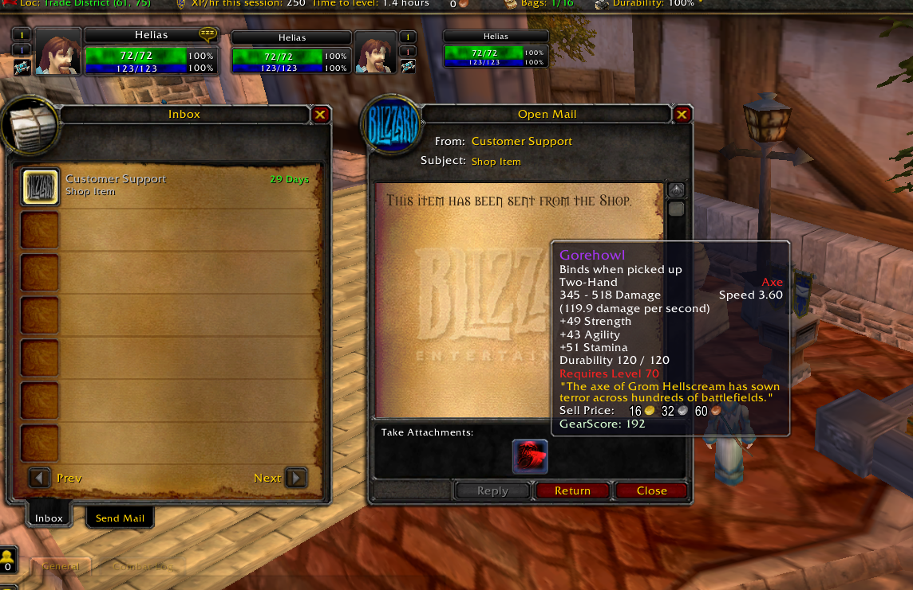

## Configure and connect the CMS webshop to AzerothCore

### Conenct the CMS to AzerothCore

First of all, **enable SOAP** in your core, so go to the `worldserver.conf` and enable SOAP changing the parameter `SOAP.Enabled` to `1`, than connect the CMS with your game server following the steps below.

If you will work in localhost put as `SOAP.IP` your LOCAL IP address.

When your CMS is up you still need to connect it with your game server through the acore-wp-plugin, so step by step:

- go to the admin panel of the CMS (`localhost:81/wp-admin.php`)
- on `Plugins -> Installed Plugins`
- Activate `AzerothCore Wordpress Integration`
- Activated, go to `Settings -> Acore Settings Panel`, fill all the fields with the right credentials and save (if you have the game database in localhost use your LOCAL IP address instead of 127.0.0.1 or localhost)

If during the registration it fails it can depend on the permissions of the access of your local mysql database, be sure to grant the permission to external connection (like the docker container with wordpress inside) can access to the mysql database.
See the **Troubleshooting** section for more details.

## Important:

Some of shop elements will not load properly if your database credentials are not correct, such as the add to cart button on the product page.

### - Register account on the game server

Wordpress by default does not allow the registration from any user so you first need to enable the registration going to `Settings -> General` and check next to `Membership` the option `Anyone can register`.

Now, when a user will register on your website, after the **verification email process**, the CMS will register an account on the game server.

For the **verification email process** there are several different options:

- install a **Mail Server** in your webserver (you can find a lot of guides online)
- Install the plugin **WP SMTP** via `Admin Panle -> Plugins -> Add new` and **[configure it with gmail or other SMTP server](https://www.wpbeginner.com/plugins/how-to-send-email-in-wordpress-using-the-gmail-smtp-server/)**, you just need to have a mail like GMAIL and connect it to WP .
- Remove the verification email process

For the last option you have to:

- install and activate the plugin **Auto Login New User After Registration**
- go to `Settings -> Auto Login New User After Registration`
- check the checkbox next to `Check to ENABLE Password required fields on new user registration form`

With this, the users do not need to confirm their emails and the game account will be created istantly.
I recommend you to install the plugin `Manage Notification E-mails` to manage in detail the email sending from your website to the users or to the admins.

**If you get some error during the registration of the user see below the troubleshooting section.**

### - Enable the shop

To add the shop in your website selling items and services you have to:

- install and configure WooCommerce plugin using `Admin Panel -> Plugins -> Add new` (you can skip the configuration and remove all the shipment options).
  Now the pages like `Cart, Shop, Checkout` will be created and added into your menu, you can edit them from `Pages`.
  Remember to set the right currency and manage all the related woocommerce settings.
- create a product going to `Admin Panel -> Product -> Create new product`
  - be sure to put the product as "Virtual"
  - put a price in the `General` section
  - set the SKU as `itemsend_28773` to sell the item 28773 (Gorehowl)
- well, you are selling items but there are no payments method you can install the plugin `WooCommerce PayPal Checkout Payment Gateway` to add PayPal but you can also add other plugins to add more payment method (example: `Woocommerce Stripe Gateway`).
  After the installation remember to enable `Paypal standard` from `Admin Panel -> Woocommerce -> Settings -> Payments` and enable PayPal standard, later click on `Manage` and add your email to receive the payments.
- **(optional)** install the plugin `myCred` to add **"virtual points"** in your website, this will allow you to define a relation between money and your virtual point, so any user can buy items in the shopt through virtual points and buy virtual points with €/$



Besides items you can also sell:

- Guild Rename (using as SKU `guild-rename`)
- Character Rename (using as SKU `char-change-name`)
- Character Customization (using as SKU `char-change-customize`), include rename
- Change Race (using as SKU `char-change-race`), include rename and customization
- Change Faction (using as SKU `char-change-faction`), include rename and customization
- Item Restoration (using as SKU `item-restoration`), this allows to restore the item deleted or sold (check `ItemDelete` worldserver conf)
- Carbon Copy tickets (using as SKU `carboncopy-tickets`), this works only if you have the [CarbonCopy lua script](https://github.com/55Honey/Acore_CarbonCopy/).
- Transmog item and itemset (using as SKU `transmog-item_ITEMID` and `transmog-itemset_ITEMSETID`), this works only if you have the [Transmog module](https://github.com/azerothcore/mod-transmog)
- Name Unlock (using as SKU `name-unlock`), this frees up a character name if unused for a while.

**Note:** if you want to sell a cumulative item you can use the `SKU itemsend_ITEM-ID_stack`.

## Troubleshooting

For everything ask help on [Discord](https://discord.gg/gkt4y2x) in the channel `#acore-cms` (section `TOOLS`), you can also tag @Helias for any issue about this CMS.

Errors:

- **During the registration I get some PDO errors**
- **Host is not allowed to connect to this mysql**

For both, the problem is probably related to the permissions of the access to your local mysql database.
**How to solve:** edit the mysql permission and create a new user.

Edit the mysql permission of mysql using:

```
sudo nano /etc/mysql/mysql.conf.d/mysqld.cnf
```

Change the `bind-address` option into 0.0.0.0 to allow the access from any IPs or just put the specific IP address allowed to connect to the database.

Create a new mysql user, like "acore" with:

```SQL
CREATE USER 'acore'@'localhost' IDENTIFIED BY 'some_pass';
GRANT ALL PRIVILEGES ON *.* TO 'acore'@'localhost' WITH GRANT OPTION;
CREATE USER 'acore'@'%' IDENTIFIED BY 'some_pass';
GRANT ALL PRIVILEGES ON *.* TO 'acore'@'%' WITH GRANT OPTION;
```

Update the configuration into Wordpress `Admin Panel -> Settings -> Acore Settings Panel` with the new user and do not set "localhost" but the LOCAL IP ADDRESS of your machine.

---

**Error**: could not be connect to the host (during the registration)
**How to solve**: check the SOAP configuration in `worldserver.conf` and into the CMS on `Admin Panel -> Settings -> Acore Settings Panel`.
To check the SOAP credentials you can use the script [here](https://stackoverflow.com/questions/59382665/how-to-send-commands-using-soap-to-azerothcore-worldserver-console).
